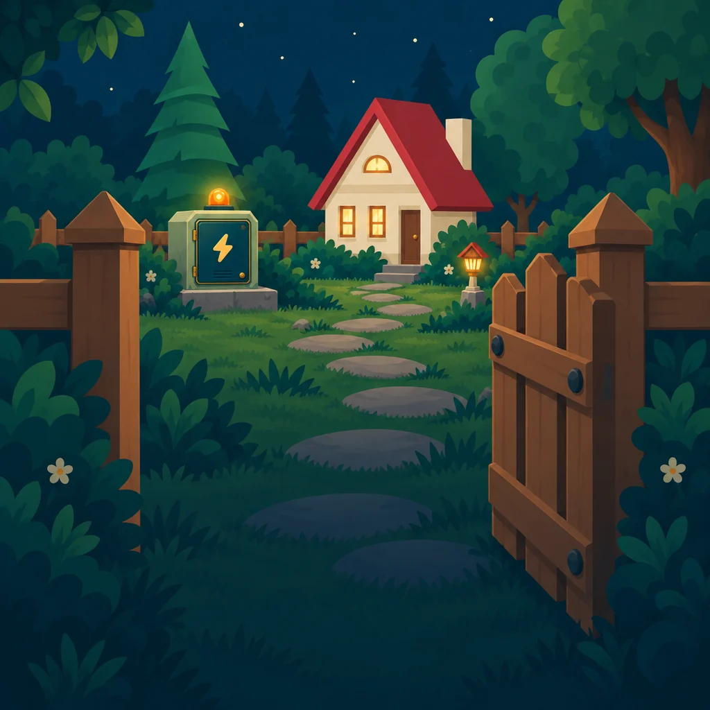

# ✨ Тёплый свет

Ночная головоломка: поверни трубы, проведи заряд от трансформатора к дому и успей, пока не иссяк запас энергии. На пути встречаются звёзды, реле, обрывы и подземные линии.

**TypeScript · SVG · Vite** — собственная игровая логика, адаптивный интерфейс, подсказки, звук и сохранение прогресса.



## Играть и разрабатывать

Нужны **Node.js 22.18+** и npm.

```bash
npm ci
npm run dev
```

Игра откроется на `http://127.0.0.1:4173/`. Для проверки с телефона в одной сети запусти `npm run phone` и открой адрес компьютера с портом `4173`.

В первой главе 26 уровней. Следующая глава пока закрыта.

Игра доступна на русском и английском. Язык определяется автоматически; изменить его можно кнопкой 🌐 в меню или в настройках. Ручной выбор сохраняется между запусками.

## Сборка и проверка

```bash
npm run build
npm run check
```

Готовая игра появится в `dist/`: для размещения на статическом хостинге публикуй **содержимое** этой папки. Уровни создаются из исходников в `resources/references/ui-review/`; правки в `public/levels/` будут перезаписаны сборкой.

Как устроены уровни, сохранения и проверки, описано в [путеводителе по проекту](docs/DEVELOPMENT.md). Идеи и исправления можно предложить по [правилам участия](CONTRIBUTING.md).

## Лицензия

Код и оригинальные материалы проекта — [MIT](LICENSE). Сторонние шрифты, музыка, звуки и графика сохраняют свои условия; сведения о них лежат в [`public/licenses/`](public/licenses/).

Разработчик — [Виктор Козинцев · PuskWeb](https://puskweb.ru/).
